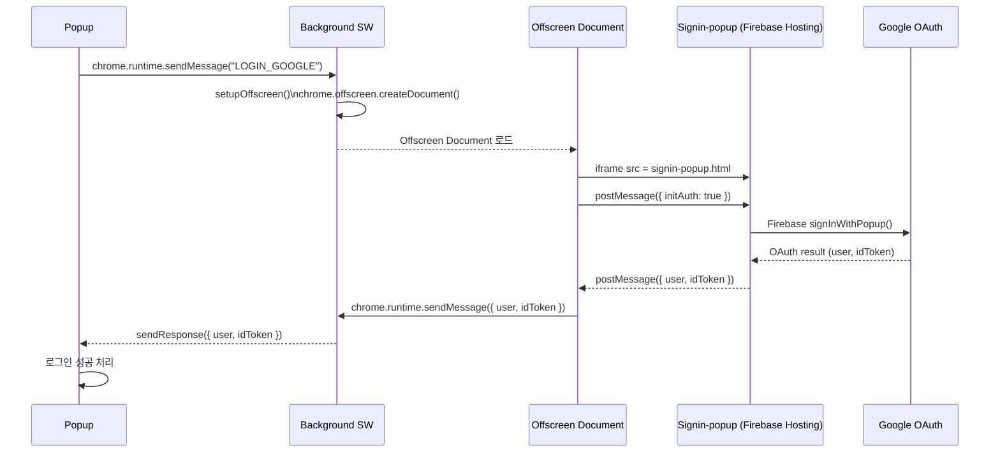

# Chrome Extension MV3에서 Google 로그인 구현기

— "스크립트가 추가가 안 돼서 당황했다"에서 시작된 Offscreen + Firebase OAuth 구조 설계

Chrome Extension을 처음 개발하면서 웹 개발하던 감각 그대로 Firebase Google 로그인을 붙이려 했다.

웹에서는

```html
<script src="firebase.js"></script>
<script>
  signInWithPopup();
</script>
```

이런 식으로 Firebase SDK를 `<script>`로 불러오고 `signInWithPopup()`을 호출하면 문제없이 동작한다.

그래서 나도 확장 프로그램에서도 똑같이 하면 되겠지 하고 시작했다.

그런데…

## 1. 처음부터 막혀버렸다: 스크립트가 실행되지 않는다

처음에 `popup.html`에 Firebase SDK `<script>`를 추가했는데 아무 반응이 없었다.

콘솔을 열어보니 이런 에러가 수십 개…

```
Refused to load the script because it violates Content Security Policy
Refused to execute inline script
Content Security Policy of your extension does not allow this script
```

처음엔

- 경로가 틀렸나?
- Firebase CDN 주소가 바뀌었나?
- 팝업 파일 구조가 잘못됐나?

같은 단순한 문제라고 생각했다.

하지만 그게 아니었다.

## 2. 문제는 내 코드가 아니라 Manifest V3 구조였다

관련 문서, 이슈, 레퍼런스를 찾아보다가 핵심을 한 줄로 요약하면 이랬다.

> "아, 내가 하려던 방식은 사실상 MV2까지나 가능했고, MV3에서는 구조와 정책이 완전히 바뀌어버렸구나."

나는 MV2를 써본 적은 없지만, 검색해보니 MV2 시절에는 popup/background 페이지가 웹 페이지처럼 동작해서 외부 `<script>`도 꽤 자유롭게 로딩할 수 있었다고 한다.

하지만 MV3부터 Chrome Extension은 보안 정책(CSP)이 완전히 달라졌다.

## MV3에서 Firebase Auth가 바로 안 되는 이유

### 1) `<script>` inline 코드 완전 금지

```html
<script>
  // 이건 MV3에서 절대 안 됨
</script>
```

### 2) 외부 스크립트 로딩도 CSP에서 대부분 차단

`https://www.gstatic.com/firebasejs/...` 같은 SDK 스크립트조차 기본적으로 MV3에서는 차단된다.

### 3) Background가 Service Worker로 변경됨

- DOM 없음
- window 없음
- 팝업 직접 호출 불가
- 상태 유지 어려움

즉, Firebase SDK를 Extension 내부에서 로딩하고 `signInWithPopup()`을 호출하는 방식 자체가 MV3에선 구조적으로 불가능하다.

이걸 깨닫는 순간, 아예 다른 방향의 아키텍처를 고민하게 됐다.

## 3. 결론: OAuth는 "확장 프로그램 외부 페이지"에서 수행하고

Extension은 결과만 메시지로 받아오는 구조로 설계하자

생각을 완전히 바꿨다.

- Firebase SDK 로딩
- Google OAuth 팝업
- `signInWithPopup` 호출

이 모든 로직을 확장 프로그램 밖의 일반 웹 페이지에서 실행하고, 확장 프로그램은 단지 "요청 → 결과 수신"만 하는 방식으로 아키텍처를 재설계했다.

그때 등장한 핵심 기술이:

- Offscreen Document
- iframe
- postMessage
- chrome.runtime.sendMessage
- Firebase Hosting에 올린 로그인 페이지

였다.

## 4. 최종 설계된 전체 흐름

아래는 내가 실제로 구현한 Firebase Google 로그인 전체 플로우다.

```
[Popup]
    ↓ sendMessage("LOGIN_GOOGLE")

[Background SW]
    ↓ setupOffscreen() → chrome.offscreen.createDocument()

[Offscreen Document]
    ↓ iframe 생성 → signin-popup 페이지 로드 (Firebase Hosting)
    ↓ postMessage({ initAuth: true })

[Signin-popup (외부 웹 페이지)]
    ↓ Firebase SDK signInWithPopup() 실행 → Google OAuth 팝업
    ↓ postMessage({ user, idToken })

[Offscreen Document]
    ↓ chrome.runtime.sendMessage({ user, idToken })

[Background SW]
    ↓ sendResponse()

[Popup]
    ↓ 로그인 결과 수신 & 저장
```

## 5. Mermaid 시퀀스 다이어그램



## 6. 구현 핵심 요약

- MV3에서는 Firebase SDK를 확장 프로그램 내부에서 직접 사용할 수 없다
- `signInWithPopup()`은 외부 웹 환경에서만 정상 작동한다
- Offscreen은 DOM이 필요한 작업의 "중간 브릿지" 역할
- 최종적으로 메시징 구조로 데이터를 이동시킨다

## 7. 마무리: MV3는 코드 문제가 아니라 "아키텍처 문제"다

Chrome Extension MV3는 보안·CSP·실행환경 정책이 매우 강하게 적용되는 구조다.

그래서 MV2/Web처럼 `<script>` 넣고 Firebase Auth를 붙이는 방식은 MV3에서는 더 이상 사용할 수 없다.

나는 이걸 직접 삽질하면서 배웠고, 결국 구조를 완전히 바꾸는 방식으로 해결하게 되었다.

이 글이 MV3에서 OAuth를 구현하려는 다른 개발자들에게 조금이나마 도움이 되면 좋겠다.
