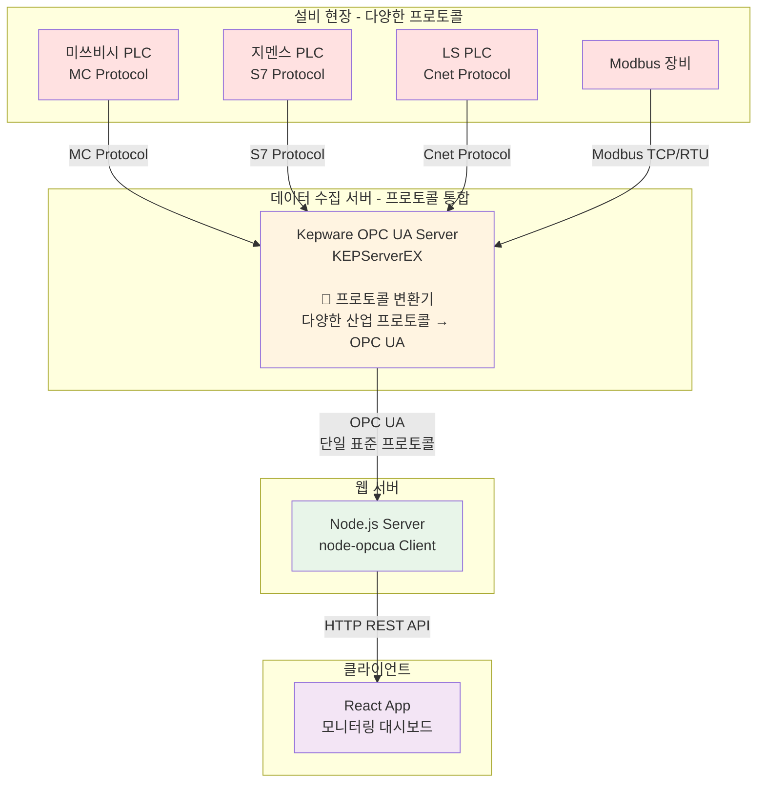

# Kepware OPC UA 서버에서 React로 설비 데이터 실시간 모니터링하기

## 배경

제조 현장에서 PLC나 설비의 데이터를 웹에서 모니터링해야 하는 요구사항이 있었습니다. 설비 데이터는 Kepware라는 OPC UA 서버를 통해 노출되고 있었고,<br>
이를 React 기반 웹 대시보드로 실시간 모니터링하는 시스템을 구축하게 되었습니다.

## 시스템 구조



**구조 설명:**

- **다양한 설비/PLC**: 제조사별로 서로 다른 통신 프로토콜 사용

  - 미쓰비시: MC Protocol
  - 지멘스: S7 Protocol
  - LS일렉트릭: Cnet/XGT Protocol
  - 범용 장비: Modbus TCP/RTU

- **Kepware의 역할 (프로토콜 통합 허브)**:

  - 마치 IoT의 SmartThings Hub나 Matter처럼, 다양한 산업 프로토콜을 하나의 표준(OPC UA)으로 통합
  - 각 제조사별 드라이버를 통해 설비와 통신
  - 모든 데이터를 OPC UA라는 단일 인터페이스로 노출

- **Node.js**: OPC UA Client로서 Kepware에 접속하여 데이터를 읽고, REST API로 React에 전달

- **React**: 사용자가 보는 웹 UI, Node.js API를 통해 설비 데이터를 조회하고 표시

### Kepware가 해결하는 문제

제조 현장에서는 다양한 제조사의 설비가 혼재되어 있고, 각각 다른 프로토콜을 사용합니다. 이를 직접 연동하려면:

```javascript
// ❌ Kepware 없이 직접 연동하면...
const mitsubishiClient = new MCProtocolClient();
const siemensClient = new S7Client();
const lsClient = new CnetClient();
const modbusClient = new ModbusClient();

// 각각 다른 방식으로 데이터를 읽어야 함
const temp1 = await mitsubishiClient.read("D100");
const temp2 = await siemensClient.readDB(1, 0, 4);
const temp3 = await lsClient.read("%MW100");
const temp4 = await modbusClient.readHoldingRegisters(0, 1);
```

**Kepware를 사용하면:**

```javascript
// ✅ Kepware를 통하면 모두 동일한 OPC UA 방식으로
const temp1 = await session.read("ns=2;s=Mitsubishi.PLC1.Temperature");
const temp2 = await session.read("ns=2;s=Siemens.PLC2.Temperature");
const temp3 = await session.read("ns=2;s=LS.PLC3.Temperature");
const temp4 = await session.read("ns=2;s=Modbus.Device1.Temperature");
```

이는 IoT 분야에서 삼성 SmartThings Hub나 Matter 프로토콜이 Zigbee, Z-Wave, Wi-Fi 등 다양한 통신 방식을 하나로 통합하는 것과 같은 개념입니다.

## Kepware 서버 설정

Node.js에서 접속하기 전에 Kepware 쪽에서 먼저 준비해야 합니다.

### 1. OPC UA Server 활성화

Kepware(KEPServerEX) 설정에서 OPC UA Server 기능을 활성화하고 Endpoint URL을 확인합니다.

예시: `opc.tcp://192.168.0.100:49320`

### 2. Security 설정 (테스트용)

처음 개발 단계에서는 보안 설정을 단순하게 유지합니다:

- **Security Policy**: None
- **User Authentication**: Anonymous

실제 운영 환경에서는 보안 정책을 강화해야 하지만, 초기 개발 단계에서는 연결을 단순화합니다.

### 3. Channel / Device / Tag 구성

Kepware에서 데이터를 노출하기 위한 구조를 만듭니다:

```
Channel: Channel1
  └─ Device: PLC1
       ├─ Temperature (온도)
       ├─ Pressure (압력)
       └─ Status (상태)
```

각 Tag는 OPC UA NodeId로 노출됩니다:

- 형식: `ns=2;s=Channel1.PLC1.Temperature`
- `ns=2`: Namespace Index (Kepware는 보통 2)
- `s=`: String Identifier
- `Channel1.PLC1.Temperature`: Tag의 전체 경로

**NodeId 확인 방법:**

- UA Expert 같은 OPC UA 클라이언트 도구 사용
- Kepware의 Quick Client 기능 사용

## Node.js 서버 구현

### 패키지 설치

```bash
npm install express cors node-opcua
```

### 서버 코드

```javascript
// server/index.js
const express = require("express");
const cors = require("cors");
const {
  OPCUAClient,
  AttributeIds,
  MessageSecurityMode,
  SecurityPolicy,
} = require("node-opcua");

const app = express();
app.use(cors());

// Kepware OPC UA 서버 주소
const endpointUrl = "opc.tcp://192.168.0.100:49320";

// 보안 설정 (테스트용)
const clientOptions = {
  securityMode: MessageSecurityMode.None,
  securityPolicy: SecurityPolicy.None,
  endpointMustExist: false,
};

// 단일 Tag 읽기 API
app.get("/api/read/:nodeId", async (req, res) => {
  const nodeId = decodeURIComponent(req.params.nodeId);
  const client = OPCUAClient.create(clientOptions);

  try {
    console.log("Connecting to Kepware:", endpointUrl);
    await client.connect(endpointUrl);
    const session = await client.createSession();

    const dataValue = await session.read({
      nodeId,
      attributeId: AttributeIds.Value,
    });

    await session.close();
    await client.disconnect();

    res.json({
      nodeId,
      value: dataValue.value.value,
      statusCode: dataValue.statusCode.toString(),
      timestamp: new Date(),
    });
  } catch (e) {
    console.error("OPC UA error:", e);
    try {
      await client.disconnect();
    } catch (_) {}
    res.status(500).json({
      error: "OPC UA read failed",
      detail: String(e),
    });
  }
});

// 여러 Tag 한번에 읽기 API
app.post("/api/read-multiple", express.json(), async (req, res) => {
  const { nodeIds } = req.body; // ["ns=2;s=...", "ns=2;s=..."]
  const client = OPCUAClient.create(clientOptions);

  try {
    await client.connect(endpointUrl);
    const session = await client.createSession();

    // 여러 NodeId를 한번에 읽기
    const nodesToRead = nodeIds.map((nodeId) => ({
      nodeId,
      attributeId: AttributeIds.Value,
    }));

    const dataValues = await session.read(nodesToRead);

    await session.close();
    await client.disconnect();

    const results = nodeIds.map((nodeId, index) => ({
      nodeId,
      value: dataValues[index].value.value,
      statusCode: dataValues[index].statusCode.toString(),
      timestamp: new Date(),
    }));

    res.json(results);
  } catch (e) {
    console.error("OPC UA error:", e);
    try {
      await client.disconnect();
    } catch (_) {}
    res.status(500).json({
      error: "OPC UA read failed",
      detail: String(e),
    });
  }
});

app.listen(4000, () => {
  console.log("Kepware OPC API server running on http://localhost:4000");
});
```

**주요 포인트:**

- `/api/read/:nodeId`: 단일 Tag 값을 읽는 엔드포인트
- `/api/read-multiple`: 여러 Tag를 한 번에 읽어 성능 개선
- 매 요청마다 연결을 생성하고 종료 (간단하지만 성능은 떨어짐)
- 실제 운영에서는 Session을 재사용하는 것이 좋음

## React 클라이언트 구현

### 패키지 설치

```bash
npm install @tanstack/react-query
```

### 단일 Tag 모니터링

```jsx
// src/hooks/useKepwareTag.js
import { useQuery } from "@tanstack/react-query";

export function useKepwareTag(nodeId, refetchInterval = 2000) {
  return useQuery({
    queryKey: ["kepwareTag", nodeId],
    queryFn: async () => {
      const res = await fetch(
        `http://localhost:4000/api/read/${encodeURIComponent(nodeId)}`
      );
      if (!res.ok) throw new Error("Failed to fetch");
      return res.json();
    },
    refetchInterval, // 주기적 폴링
    enabled: !!nodeId,
  });
}
```

```jsx
// src/App.jsx
import { useKepwareTag } from "./hooks/useKepwareTag";

export default function App() {
  const nodeId = "ns=2;s=Channel1.PLC1.Temperature";
  const { data, isLoading, isError, error } = useKepwareTag(nodeId);

  if (isLoading) return <div>Loading...</div>;
  if (isError) return <div>Error: {String(error)}</div>;

  return (
    <div style={{ padding: 40, fontFamily: "system-ui" }}>
      <h2>Kepware OPC UA Tag Monitor</h2>
      <div
        style={{
          padding: 20,
          background: "#f5f5f5",
          borderRadius: 8,
        }}
      >
        <p>
          <strong>Tag:</strong> {data.nodeId}
        </p>
        <p>
          <strong>Value:</strong> {String(data.value)}
        </p>
        <p>
          <strong>Status:</strong> {data.statusCode}
        </p>
        <p>
          <strong>Updated:</strong> {data.timestamp}
        </p>
      </div>
    </div>
  );
}
```

### 여러 Tag 동시 모니터링

실제 현장에서는 여러 설비의 데이터를 동시에 모니터링해야 합니다.

```jsx
// src/hooks/useKepwareTags.js
import { useQuery } from "@tanstack/react-query";

export function useKepwareTags(nodeIds, refetchInterval = 2000) {
  return useQuery({
    queryKey: ["kepwareTags", nodeIds],
    queryFn: async () => {
      const res = await fetch("http://localhost:4000/api/read-multiple", {
        method: "POST",
        headers: { "Content-Type": "application/json" },
        body: JSON.stringify({ nodeIds }),
      });
      if (!res.ok) throw new Error("Failed to fetch");
      return res.json();
    },
    refetchInterval,
    enabled: nodeIds.length > 0,
  });
}
```

```jsx
// src/components/EquipmentDashboard.jsx
import { useKepwareTags } from "../hooks/useKepwareTags";

export default function EquipmentDashboard() {
  const tags = [
    { id: "ns=2;s=Channel1.PLC1.Temperature", label: "온도" },
    { id: "ns=2;s=Channel1.PLC1.Pressure", label: "압력" },
    { id: "ns=2;s=Channel1.PLC1.Status", label: "상태" },
  ];

  const nodeIds = tags.map((t) => t.id);
  const { data, isLoading } = useKepwareTags(nodeIds, 2000);

  if (isLoading) return <div>Loading...</div>;

  return (
    <div style={{ padding: 40 }}>
      <h2>설비 모니터링 대시보드</h2>
      <table
        style={{
          width: "100%",
          borderCollapse: "collapse",
        }}
      >
        <thead>
          <tr style={{ background: "#f0f0f0" }}>
            <th style={{ padding: 12, textAlign: "left" }}>항목</th>
            <th style={{ padding: 12, textAlign: "left" }}>값</th>
            <th style={{ padding: 12, textAlign: "left" }}>상태</th>
            <th style={{ padding: 12, textAlign: "left" }}>업데이트</th>
          </tr>
        </thead>
        <tbody>
          {data?.map((item, index) => (
            <tr key={item.nodeId} style={{ borderBottom: "1px solid #ddd" }}>
              <td style={{ padding: 12 }}>{tags[index].label}</td>
              <td style={{ padding: 12, fontWeight: "bold" }}>
                {String(item.value)}
              </td>
              <td style={{ padding: 12 }}>
                {item.statusCode === "Good(0x00000)" ? "✅" : "❌"}
              </td>
              <td style={{ padding: 12, fontSize: 12, color: "#666" }}>
                {new Date(item.timestamp).toLocaleTimeString()}
              </td>
            </tr>
          ))}
        </tbody>
      </table>
    </div>
  );
}
```

## 실행 순서

### 1. Kepware 준비

- OPC UA Server 활성화
- Endpoint URL 확인: `opc.tcp://192.168.0.100:49320`
- Channel/Device/Tag 설정
- NodeId 확인: `ns=2;s=Channel1.PLC1.Temperature`

### 2. Node.js 서버 실행

```bash
cd server
node index.js
```

서버가 `http://localhost:4000`에서 실행됩니다.

### 3. React 앱 실행

```bash
cd client
npm run dev
```

브라우저에서 `http://localhost:5173` 접속하여 설비 데이터를 확인합니다.

## 발생할 수 있는 문제와 해결

### 1. 연결 실패: "getaddrinfo ENOTFOUND"

**원인:** Kepware 서버의 IP 주소가 잘못되었거나 네트워크가 연결되지 않음

**해결:**

- Kepware가 실행 중인지 확인
- IP 주소와 포트 번호 재확인
- 방화벽 설정 확인 (포트 49320 열려있는지)

### 2. "BadSecureChannelClosed" 에러

**원인:** Security 설정이 맞지 않음

**해결:**

- Kepware에서 Anonymous 접속 허용 확인
- Security Policy를 None으로 설정
- 필요시 User/Password 인증 추가:

```javascript
const session = await client.createSession({
  userName: "your-username",
  password: "your-password",
});
```

### 3. NodeId를 찾을 수 없음

**원인:** NodeId가 잘못되었거나 Tag가 Kepware에 없음

**해결:**

- UA Expert로 실제 NodeId 확인
- Kepware Quick Client에서 Tag 경로 확인
- Namespace Index가 맞는지 확인 (보통 ns=2)

## 성능 최적화

### 문제: 매 요청마다 연결 생성

현재 구현은 간단하지만, 매번 OPC UA 연결을 맺고 끊기 때문에 비효율적입니다.

### 해결: Session 재사용

```javascript
// 전역 Session 관리
let globalSession = null;

async function getSession() {
  if (!globalSession) {
    const client = OPCUAClient.create(clientOptions);
    await client.connect(endpointUrl);
    globalSession = await client.createSession();
  }
  return globalSession;
}

app.get("/api/read/:nodeId", async (req, res) => {
  try {
    const session = await getSession();
    const dataValue = await session.read({
      nodeId: req.params.nodeId,
      attributeId: AttributeIds.Value,
    });
    // ... 응답 처리
  } catch (e) {
    // 연결 끊어졌으면 재연결
    globalSession = null;
    // ... 에러 처리
  }
});
```

이렇게 하면 연결을 재사용하여 성능이 크게 향상됩니다.

## 다음 단계

기본적인 모니터링 시스템을 구축했다면, 다음과 같은 기능을 추가할 수 있습니다:

1. **값 쓰기 기능**: React에서 설비 값을 변경
2. **WebSocket 실시간 푸시**: 폴링 대신 변경사항만 즉시 전달
3. **차트 시각화**: 시간에 따른 데이터 변화를 그래프로 표시
4. **알람 시스템**: 임계값 초과 시 알림
5. **이력 데이터 저장**: 데이터베이스에 저장하여 추세 분석

## 마무리

Kepware OPC UA 서버에서 React로 설비 데이터를 모니터링하는 시스템을 구축했습니다.<br>
Node.js가 중간 레이어 역할을 하여 OPC UA 프로토콜을 REST API로 변환하고,<br> React는 이를 사용자 친화적인 UI로 표시합니다.

핵심 포인트:

- **Kepware 설정**: OPC UA Server 활성화 및 NodeId 확인
- **Node.js**: OPC UA Client로 Kepware에 연결하고 REST API 제공
- **React**: React Query로 주기적 폴링하여 실시간 모니터링
- **성능 개선**: 여러 Tag를 한 번에 읽고, Session 재사용

이 구조는 제조 현장의 설비 모니터링뿐만 아니라, 다양한 산업 자동화 시스템에 적용할 수 있습니다.
